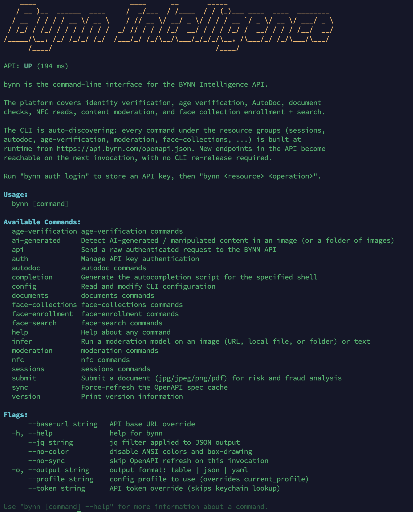

# bynn


Command-line interface for the [BYNN Intelligence](https://bynn.com) API — identity verification, age verification, AutoDoc, document fraud analysis, NFC, content moderation, and face collections.

The CLI is **auto-discovering**: every command is built at runtime from the live OpenAPI spec at `https://api.bynn.com/openapi.json`. New endpoints in the API surface in the CLI on the next invocation, with no re-install.



## Install

### macOS and Linux (Homebrew)

```bash
brew install bynn-intelligence/bynn/bynn
```

### Windows (Scoop)

```powershell
scoop bucket add bynn https://github.com/Bynn-Intelligence/scoop-bynn
scoop install bynn
```

### Linux (.deb / .rpm)

Grab the package matching your architecture from the [latest release](https://github.com/Bynn-Intelligence/bynn-cli/releases/latest), e.g.:

```bash
# Debian / Ubuntu (amd64)
curl -LO https://github.com/Bynn-Intelligence/bynn-cli/releases/latest/download/bynn_$(uname -m).deb
sudo apt install ./bynn_*.deb

# RHEL / Fedora (amd64)
sudo rpm -i https://github.com/Bynn-Intelligence/bynn-cli/releases/latest/download/bynn_*.rpm
```

### One-line installer (any unix)

```bash
curl -fsSL https://raw.githubusercontent.com/Bynn-Intelligence/bynn-cli/main/install.sh | sh
```

The installer detects your OS and architecture, downloads the matching binary from the latest release, and places it at `/usr/local/bin/bynn` (or `~/.local/bin/bynn` if you can't write to `/usr/local/bin`).

### Manual download

Pre-built binaries for every supported platform live in [Releases](https://github.com/Bynn-Intelligence/bynn-cli/releases/latest). Download, extract, and place `bynn` somewhere on your `PATH`.

## Quick start

```bash
# 1. Authenticate (your private key is stored in the OS keychain)
bynn auth login

# 2. Verify
bynn auth whoami
# profile=live mode=live base_url=https://api.bynn.com/v1
```

### Submit a PDF for fraud and risk analysis

```bash
# Send a document for analysis — supports jpg, jpeg, png, pdf.
# By default, submit blocks (with an animated spinner on stderr) until
# analysis finishes, then prints the full styled risk report.
bynn submit ./invoice.pdf --reference case-1234
```

Want to upload and return immediately with the create response (no waiting)? Add `--no-poll`:

```bash
bynn submit ./invoice.pdf --no-poll
# → document_id, submission_id, status=received — fetch the result later
```

You can also fetch an existing submission's result directly. **`bynn documents get` also polls by default**:

```bash
bynn documents get <document_id>            # blocks until analyzed
bynn documents get <document_id> --no-poll  # one-shot, no waiting
```

Polling timing is configurable on either command:

```bash
bynn documents get <document_id> \
    --poll-timeout 10m   \
    --poll-interval 5s
```

Useful flags on `submit`:

```bash
# attach metadata that travels with the submission
bynn submit ./id.jpg --reference case-1234 \
    --document-type passport \
    --side front \
    --issuing-country USA \
    --tenant-id acme \
    --case-id INC-42

# preview the JSON body that would be sent (file content redacted) without actually submitting
bynn submit ./id.jpg --reference case-1234 --dry-run -o json

# pipe submit + get for a one-liner (returns just the final status)
bynn submit ./id.jpg --reference case-1234 -o json \
    --jq '{document_id, status, analysis_risk_status, analysis_risk_score, risk_tags}'
```

### Other common operations

```bash
# Identity verification sessions
bynn sessions create --body '{"reference":"verify-abc"}'
bynn sessions get <session_id>

# AutoDoc invitations
bynn autodoc invitations-list --all
bynn autodoc invitations-create --body '{"...":"..."}'

# Content moderation model catalog (no auth needed)
bynn moderation models-all
```

Run `bynn --help` to see every command. Append `--help` to any subcommand for detailed flags and examples (sourced from the live OpenAPI spec, so they always reflect the current API).

## Profiles

Run against multiple environments without juggling tokens:

```bash
bynn config use sandbox            # switch active profile
bynn auth login --profile sandbox  # store a sandbox key
bynn config list                   # see all profiles
```

Test vs. live mode is encoded in the API key prefix (`private_sandbox_...` vs. `private_...`); no separate flag needed.

## Output formats

```bash
bynn moderation models-all                       # default: styled table with sub-tables
bynn moderation models-all -o json               # raw JSON
bynn moderation models-all -o yaml               # YAML
bynn moderation models-all --jq '.[].api_name'   # gojq filter
```

### Notes on the table view

- Status fields (`status`, `risk_status`, `analysis_risk_status`) are colored by value: green for terminal-good (`analyzed`, `low`, `verified`), yellow for in-flight (`pending`, `medium`), red for failures (`high`, `failed`, `error`).
- `risk_tags` entries are rendered red so flagged indicators stand out at a glance.
- URLs are replaced with the literal text `FOR URL USE JSON OUTPUT` — the table view is for scanning, full URLs are noisy. Drop to `-o json` to see them.
- Disable colors with `--no-color`, the `NO_COLOR` env var, or by piping output to a file (auto-detected via TTY check).
- Tables auto-fit your terminal width; override with `COLUMNS=120 bynn ...` when piping into `less` or other pagers.

## Updating

```bash
brew upgrade bynn       # macOS / Linux via Homebrew
scoop update bynn       # Windows via Scoop
# or re-run the install.sh one-liner — it always fetches the latest release
```

## Support

- Documentation: [docs.bynn.com](https://docs.bynn.com)
- Dashboard: [dashboard.bynn.com](https://dashboard.bynn.com)
- Email: [hello@bynn.com](mailto:hello@bynn.com)

## License

Proprietary. © BYNN Intelligence, Inc.
